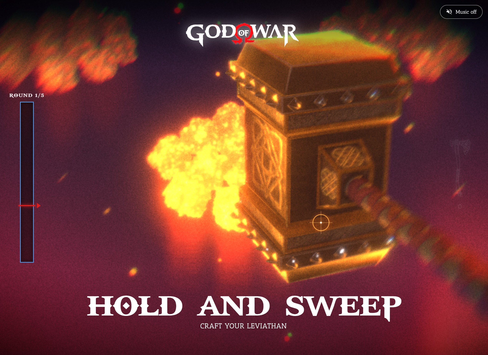
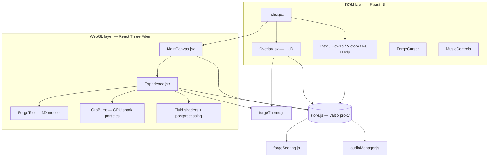
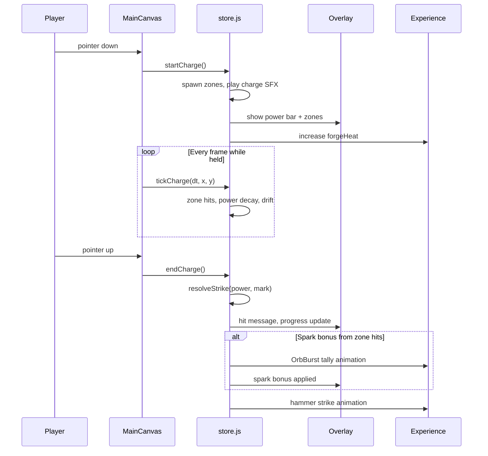
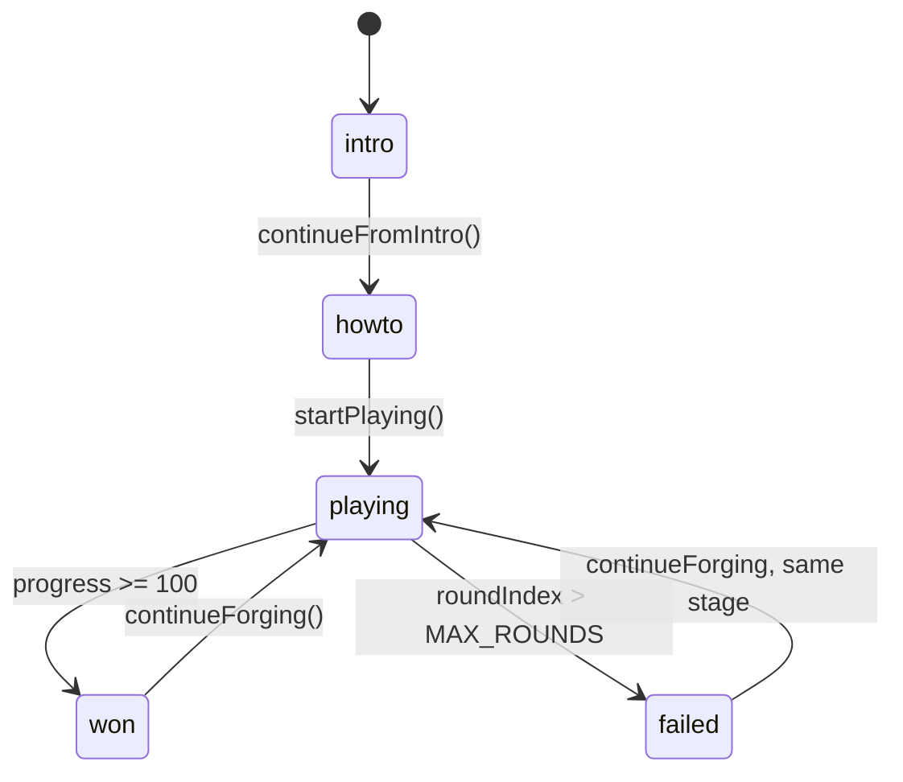

# Awaken Your Relic



A God of War–inspired forge rhythm mini-game built with React Three Fiber. Press and hold to charge the forge, drag through numbered sparks in order to build power, and release past the target mark to strike. Complete three playthroughs — hammer, Leviathan axe, and Blades of Chaos — each with its own visual theme and difficulty. Beat the final trial to unlock the source repository.

**[Play the live demo →](https://god-of-war-minigame.vercel.app/)**

## How the game works

### Core loop

Each playthrough has **3 rounds**. Each round gives you a **target mark** on the power bar. While holding the mouse button (or touch):

1. **Numbered charge zones** appear on screen. Hit them **in order** — wrong-order hits drain power and break your combo.
2. Moving the cursor **through the active zone** adds power, heats the forge, and spawns a spark for that hit.
3. **Combo chains** reward consecutive ordered hits with extra power before you release.
4. **Power decays** over time — you must keep hitting zones. Each round is timed; time running out counts as a release.
5. On release, your final power is compared to the mark:
   - **Superb** (at or above mark) — large forge progress, scaled by how far you overshot the mark
   - **Flawless** — superb strike with a long ordered streak and a full bar
   - **Weak strike** (some power, below mark) — smaller progress
   - **Miss** (zero power) — no progress

Reach **100% forge progress** before using all **3 rounds** to win the current playthrough. Fail a run and you retry the **same stage** — your weapon progress is kept.

### Spark bonus

Ordered zone hits during a charge collect **sparks**. After a strike, sparks fly into the progress meter as a **spark bonus** — extra forge progress between rounds. Input pauses until the tally animation finishes. Bonuses are capped per round so they supplement good strikes rather than replace them.

### Three playthroughs

| Stage | Tool | Theme | Difficulty highlights |
|-------|------|-------|------------------------|
| 1 | Hammer | Ember (warm purple/orange) | 2 static zones, 10s per round, marks from 48 |
| 2 | Leviathan Axe | Frost (blue) | Drifting zones, auto-reposition every ~2.2s, marks from 58 |
| 3 | Blades of Chaos | Chaos (red/orange) | 3 smaller zones, faster drift, 8s rounds, marks from 65 |

After beating stage 1 or 2, a victory screen lets you continue forging the next relic. Beating stage 3 shows the **public victory screen** with a link to the [GitHub repository](https://github.com/ektogamat/god-of-war-minigame) and a **Continue Forging** prompt.

### Game phases

The app moves through discrete **phases** managed in the global store:

| Phase | Screen | What happens |
|-------|--------|----------------|
| `intro` | IntroScreen | Title, disclaimer, start prompt |
| `howto` | HowToScreen | Controls and mechanics |
| `playing` | Overlay + Canvas | Active forge gameplay |
| `won` | VictoryScreen | Stage complete — continue to next relic or view source on stage 3 |
| `failed` | FailScreen | Out of rounds — retry the same stage |

---

## Architecture

The app splits into two layers that share one **Valtio store** (`src/store/store.js`):



**Input flow:** `MainCanvas` listens for pointer down/up on the R3F `<Canvas>`. Pointer down calls `startCharge()`; each frame, `ChargeLoop` reads pointer position and calls `tickCharge()`. Pointer up calls `endCharge()`, which resolves the strike and updates progress.



---

## Project structure

```
god-of-war-minigame/
├── public/                    # Static assets served at /
│   ├── preview.jpg            # README / social preview image
│   ├── *.glb                  # Optimized 3D models (hammer, axe, blades, nuggets)
│   ├── *.mp3                  # Music and SFX
│   ├── video_texture.mp4      # Forge fire video texture
│   ├── gow_logo.png, axe.svg  # UI branding
│   └── fonts/                 # GodOfWar, Inter, AnticSlab
│
├── src/
│   ├── index.html             # Meta tags, OG image, favicon
│   ├── index.jsx              # App shell — mounts all screens + canvas
│   ├── style.css              # Global styles + theme CSS variables
│   │
│   ├── MainCanvas.jsx         # R3F Canvas, camera, charge input loop
│   ├── Experience.jsx         # 3D scene, fluid simulation, environment
│   ├── Overlay.jsx            # In-game HUD (power bar, zones, progress, orb tally)
│   ├── Effects.jsx            # Postprocessing (bloom, vignette, etc.)
│   │
│   ├── store/
│   │   └── store.js           # Game state, phases, charge logic, SFX triggers
│   │
│   ├── utils/
│   │   ├── forgeScoring.js    # Difficulty tables, marks, strike resolution
│   │   └── audioManager.js    # Web Audio API loader and playback
│   │
│   ├── theme/
│   │   └── forgeTheme.js      # Per-playthrough colors (ember / frost / chaos)
│   │
│   ├── copy/
│   │   └── disclaimer.js      # Fan-project legal disclaimer (shared text)
│   │
│   └── Components/
│       ├── ForgeTool.jsx      # Swappable 3D tool + strike animation (GSAP)
│       ├── Table.jsx          # Forge table with video-textured surface
│       ├── GoldenNuggets.jsx  # Ambient gold mesh
│       ├── FakeFire.jsx       # Video-based fire in environment
│       ├── Particles.jsx      # Floating ember/spark particles
│       ├── ForgeCursor/       # Custom cursor during gameplay
│       ├── IntroScreen/       # Title screen
│       ├── HowToScreen/       # Tutorial
│       ├── VictoryScreen/     # Stage-complete screen
│       ├── FailScreen/        # Game-over screen
│       ├── HelpScreen/        # In-game help overlay
│       ├── LoadingScreen/     # Asset loading progress (drei useProgress)
│       ├── MusicControls/     # Background music toggle
│       ├── KeyPrompt/         # Keyboard confirm (Enter / Space)
│       ├── ThemeSync/         # Syncs CSS theme class to playthrough
│       ├── OrbBurst.jsx       # GPU spark particles (collect + tally)
│       └── OrbTally/          # Spark bonus HUD between rounds
│
├── vite.config.js             # Vite root = src/, publicDir = ../public/
├── package.json
└── README.md
```

### Key files explained

| File | Role |
|------|------|
| [`store/store.js`](src/store/store.js) | Single source of truth — phases, rounds, zones, power, progress, playthrough, spark tally. All game actions (`startCharge`, `endCharge`, `completeOrbTally`, `resetForge`, etc.) live here. |
| [`utils/forgeScoring.js`](src/utils/forgeScoring.js) | Difficulty config per playthrough (zone count, drift, round time, mark curve) and strike quality logic (`Superb`, `Flawless`, weak, miss). |
| [`utils/audioManager.js`](src/utils/audioManager.js) | Loads and plays SFX via Web Audio API with concurrency limits for overlapping sounds. |
| [`theme/forgeTheme.js`](src/theme/forgeTheme.js) | Maps playthrough → 3D/UI palette (fog, particles, fluid shader colors). |
| [`MainCanvas.jsx`](src/MainCanvas.jsx) | Bridges pointer input to the store; hosts the R3F scene. Input is blocked during spark tally. |
| [`Experience.jsx`](src/Experience.jsx) | Renders the forge scene offscreen, runs fluid simulation, composites with postprocessing, mounts `OrbBurst`. |
| [`Overlay.jsx`](src/Overlay.jsx) | Renders the 2D HUD on top of the canvas — power bar, numbered zones, round timer, forge progress, hit feedback. |
| [`Components/OrbBurst.jsx`](src/Components/OrbBurst.jsx) | WebGL spark particles — collect bursts on progress and tally flights into the meter. |
| [`ForgeTool.jsx`](src/Components/ForgeTool.jsx) | Loads hammer / axe / blades GLBs and plays wind-up + strike animations on `state.clicked`. |

---

## State model

The Valtio proxy in `store.js` drives everything reactive components subscribe to via `useSnapshot(state)`:



Important state fields:

| Field | Description |
|-------|-------------|
| `phase` | Current screen (`intro`, `howto`, `playing`, `won`, `failed`) |
| `playthrough` | Active stage (1–3) — drives theme, tool, and difficulty |
| `victoryStage` | Which stage was just cleared (used by victory copy and source-code link) |
| `activeTool` | 3D model shown (`hammer`, `axe`, `blades`) |
| `roundIndex` | Current round (1–3) |
| `progress` | Forge completion 0–100 |
| `mark` | Power target for this round |
| `power` | Current charge level while holding |
| `chargeCombo` | Ordered zone hits in the current charge |
| `zones` | Array of `{ x, y, r, order, vx, vy }` hit areas (normalized 0–1) |
| `nextZoneOrder` | Which numbered zone must be hit next |
| `roundOrbHits` | Spark values collected during the current charge |
| `orbTally` | Active spark-bonus animation between rounds |
| `orbBurst` | GPU particle burst config for collect/tally effects |
| `clicked` | Whether the player is currently charging |
| `forgeHeat` | Visual heat intensity fed to shaders and particles |

---

## Stack

- **React 18** + **Vite** — UI and bundling
- **React Three Fiber** + **Drei** — 3D scene and helpers (`useGLTF`, `Environment`, `useProgress`)
- **Three.js** — rendering, shadows, materials
- **Valtio** — reactive global game state
- **GSAP** — screen transitions, tool strike animation, HUD feedback
- **@hmng8/use-shader-fx** — real-time fluid simulation on the forge
- **@react-three/postprocessing** — bloom and color grading
- **Leva** — dev-only effect tuning (hidden in production UI)

## Getting started

```shell
npm install
npm run dev
```

Open the URL shown in the terminal (typically `http://localhost:5173`).

## Build & deploy

```shell
npm run build    # outputs to dist/
npm run deploy   # Vercel production deploy
```

Vite is configured with `root: 'src/'` and `publicDir: '../public/'`, so static assets in `public/` are served at `/` during dev and copied into `dist/` on build.

## Disclaimer

Unofficial fan project for portfolio and educational purposes only. Not affiliated with, endorsed by, or sponsored by Sony Interactive Entertainment, Santa Monica Studio, or their affiliates. God of War, Leviathan, and all related names, logos, characters, sounds, music, and assets are trademarks and copyrights of their respective owners. No commercial use is intended. All third-party materials remain the property of their respective owners.
